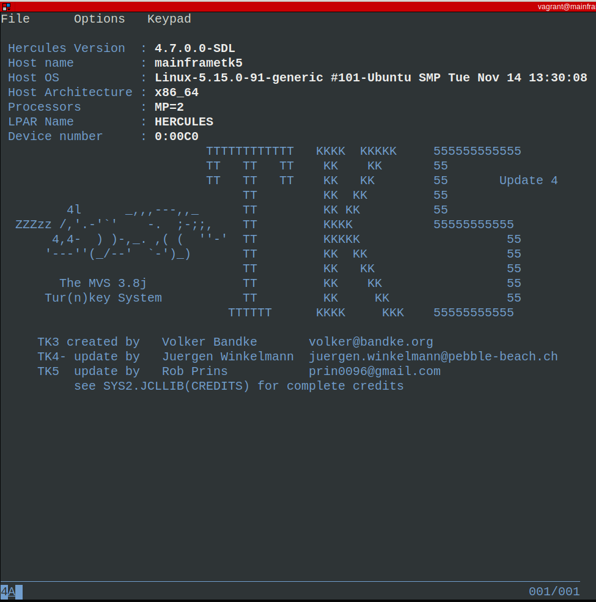
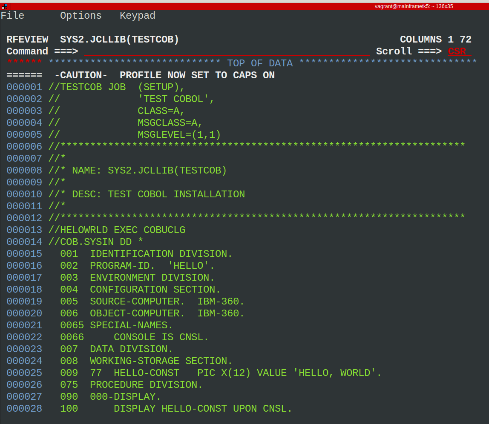

# Ubuntu - Mainframe Hercules - TK5

Run your own mainframe using Hercules mainframe emulator and MVS 3.8j TK5

## Sofftware Installed

- 3270 terminal emulator.
- Operating system in mainframe `MVS 3.8j tk5`

## Start up

- Run script within vagrant box --> `mainframe_tk5.sh`
- Open other session to use `3270 terminal emulator` to connect to the mainframe

```bash
diego@gentoo:~/CODE/vagrant/mainframe_tk5$ vagrant ssh
Last login: Sun Nov 30 03:38:56 2025 from 192.168.121.1
vagrant@mainframetk5:~$ 

vagrant@mainframe:~$ c3270 127.0.0.1:3270
```

### Connected to mainframe tk5



### COBOL example 




## Logon to TSO

Like the original Tur(n)key 3 system TK5- comes with four TSO users predefined, in addition to IBMUSER, which is the system’s initial user.

- HERC01 is a fully authorized user with full access to the RAKF users and profiles tables. The logon password is CUL8TR.
- HERC02 is a fully authorized user without access to the RAKF users and profiles tables. The logon password is CUL8TR.
- HERC03 is a regular user. The logon password is PASS4U
- HERC04 is a regular user. The logon password is PASS4U.- IBMUSER is a fully authorized user without access to the RAKF users and profiles tables. The logon password is IBMPASS. This account is meant to be used for recovery purposes only.

Follow the PDF for further commands and features

### Tricks
* `/s shutdown` to shutdown system from Hercules status window
* `logon herc01 recon` to reconnect to existing session
* `F3` to return to previous ISPF panel
* `Shift + Esc` to exit wc3270 terminal emulator

## Links

- https://bradricorigg.medium.com/run-your-own-mainframe-using-hercules-mainframe-emulator-and-mvs-3-8j-tk4-55fa7c982553
- https://www.hercules-390.eu/
- https://wotho.pebble-beach.ch/tk4-/
- https://www.prince-webdesign.nl/tk5
- See manual PDF --> `TK5-Introduction-and-User-Manual.pdf`
