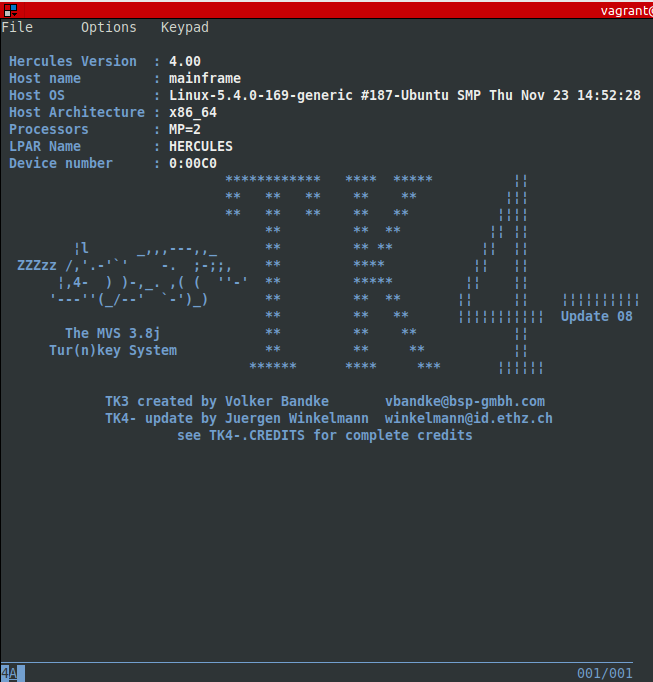

# Ubuntu - Mainframe Hercules

Run your own mainframe using Hercules mainframe emulator and MVS 3.8j tk4

## Sofftware Installed

- 3270 terminal emulator.
- Operating system in mainframe `MVS 3.8j tk4`

## Start up

- Run script within vagrant box --> `hercules_mainframe.sh`
- Open other session to use `3270 terminal emulator` to connect to the mainframe

```bash
diego@thinkpad:~/CODE/vagrant_automation/libvirt/ubuntu_mainframe$ vagrant ssh
Last login: Sat Nov 29 19:08:37 2025 from 192.168.121.1

vagrant@mainframe:~$ c3270 127.0.0.1:3270
```

Connected to mainframe



## Logon to TSO

Like the original Tur(n)key 3 system TK4- comes with four TSO users predefined, in addition
to IBMUSER, which is the system’s initial user.

- HERC01 is a fully authorized user with full access to the RAKF users and profiles tables. The logon password is CUL8TR.
- HERC02 is a fully authorized user without access to the RAKF users and profiles tables. The logon password is CUL8TR.
- HERC03 is a regular user. The logon password is PASS4U
- HERC04 is a regular user. The logon password is PASS4U.- IBMUSER is a fully authorized user without access to the RAKF users and profiles tables. The logon password is IBMPASS. This account is meant to be used for recovery purposes only.

Follow the PDF for further commands and features

## Links

- https://bradricorigg.medium.com/run-your-own-mainframe-using-hercules-mainframe-emulator-and-mvs-3-8j-tk4-55fa7c982553
- https://www.hercules-390.eu/
- https://wotho.pebble-beach.ch/tk4-/
- See manual PDF --> MVS_TK4-\_v1.00_Users_Manual.pdf
